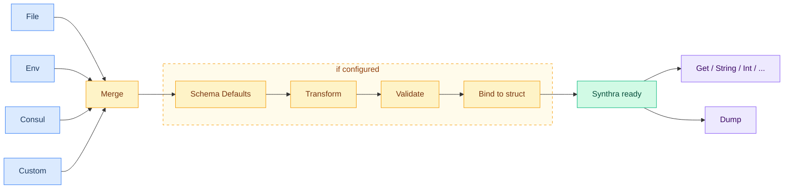

# Synthra

[](https://github.com/gopherly/synthra/actions/workflows/ci.yml)
[](https://codecov.io/gh/gopherly/synthra)
[](https://pkg.go.dev/gopherly.dev/synthra)
[](https://goreportcard.com/report/gopherly.dev/synthra)
[](./LICENSE)

**From many sources, one config.**

Synthra is a Go library that builds one configuration from many places. It reads from files, environment variables, Consul, in-memory bytes, and any custom source. It merges them in order, validates the result, and binds it to a struct if you want. The name comes from the Greek word *synthesis*, which means "to put together."

```bash
go get gopherly.dev/synthra
```

Requires Go 1.26 or later.

```go
import "gopherly.dev/synthra"
```

## How it works



## Why Synthra

Most Go services load configuration from more than one place. A YAML file holds the defaults, environment variables override them in production, and a key-value store like Consul holds shared settings. Synthra makes this simple:

- One small API for all sources.
- Clear merge order: later sources win over earlier ones.
- Twelve-Factor friendly: environment variables override files cleanly across environments.
- Automatic format detection from extension (`.yaml`, `.json`, `.toml`).
- JSON Schema defaults fill missing keys automatically.
- Dynamic schema selection based on a value inside the config itself.
- Transforms and POSIX-style variable substitution, applied after merging and before validation.
- Struct binding with type conversion, defaults, and validation.
- Case-insensitive keys with dot notation (`server.port`).
- Safe for concurrent use.
- Small core, optional extras. Consul is the only heavy dependency, and you only touch it if you need it.
- A `synthratest` helper package for tests.

## Contents

1. [How it works](#how-it-works)
2. [Quick start](#quick-start)
3. [Sources](#sources)
4. [Formats](#formats)
5. [Struct binding](#struct-binding)
6. [Default values](#default-values)
7. [JSON Schema defaults](#json-schema-defaults)
8. [Dynamic schema selection](#dynamic-schema-selection)
9. [Transforms and variable substitution](#transforms-and-variable-substitution)
10. [Validation](#validation)
11. [Reading values](#reading-values)
12. [Merge order and precedence](#merge-order-and-precedence)
13. [Case insensitivity and dot notation](#case-insensitivity-and-dot-notation)
14. [Environment variable naming](#environment-variable-naming)
15. [Dumping configuration](#dumping-configuration)
16. [Testing helpers](#testing-helpers)
17. [Custom sources and codecs](#custom-sources-and-codecs)
18. [Error handling](#error-handling)
19. [Thread safety](#thread-safety)
20. [Examples](#examples)
21. [License](#license)
22. [Contributing](#contributing)

## Quick start

Create a `config.yaml` file:

```yaml
server:
  host: "localhost"
  port: 8080
debug: true
```

Then load it:

```go
package main

import (
    "context"
    "fmt"
    "log"

    "gopherly.dev/synthra"
)

type Config struct {
    Server struct {
        Host string `synthra:"host"`
        Port int    `synthra:"port"`
    } `synthra:"server"`
    Debug bool `synthra:"debug"`
}

func main() {
    var cfg Config

    s := synthra.MustNew(
        synthra.WithFile("config.yaml"),
        synthra.WithEnv("APP_"),
        synthra.WithBinding(&cfg),
    )

    if err := s.Load(context.Background()); err != nil {
        log.Fatal(err)
    }

    fmt.Printf("listening on %s:%d (debug=%v)\n",
        cfg.Server.Host, cfg.Server.Port, cfg.Debug)
}
```

Set `APP_SERVER_PORT=9090` to override the YAML port at runtime.

## Sources

A source is any type whose `Load` method returns a `map[string]any` and an `error`. Synthra ships several built-in sources.

### File with automatic format detection

The format comes from the file extension. Supported extensions: `.yaml`, `.yml`, `.json`, `.toml`.

```go
synthra.WithFile("config.yaml")
synthra.WithFile("config.json")
synthra.WithFile("config.toml")
```

Paths support shell-style environment variable expansion: `${VAR}` or `$VAR`.

```go
synthra.WithFile("${CONFIG_DIR}/app.yaml")
```

### File with explicit format

Use this when the file has no extension, or when the extension does not match the real format.

```go
import "gopherly.dev/synthra/codec"

synthra.WithFileAs("config", codec.YAML)
synthra.WithFileAs("config.dat", codec.JSON)
```

### File inside an `io/fs.FS`

Useful for embedded files (`embed.FS`) and tests (`testing/fstest.MapFS`).

```go
import (
    "embed"
    "gopherly.dev/synthra"
)

//go:embed config.yaml
var configFS embed.FS

s := synthra.MustNew(
    synthra.WithFileFS(configFS, "config.yaml"),
)
```

You can also use `WithFileFSAs` to pass an explicit decoder.

### Environment variables

Pick a prefix. Synthra reads every variable with that prefix, removes it, lowercases the rest, and splits on `_` to build a nested map.

```go
synthra.WithEnv("APP_")
```

`APP_SERVER_PORT=8080` becomes `server.port = "8080"`.

See [Environment variable naming](#environment-variable-naming) for the full rules.

### In-memory content

Pass raw bytes and a decoder. Good for baked-in defaults.

```go
defaults := []byte(`
server:
  port: 3000
`)

synthra.WithContent(defaults, codec.YAML)
```

### Consul key-value store

Reads a key from Consul and decodes the value. The format is detected from the path, like for files.

```go
synthra.WithConsul("production/service.yaml")
```

`CONSUL_HTTP_ADDR` must be set. If it is missing, `New` returns an error at construction. For dev setups where Consul may not run, gate it with `WithIf`:

```go
synthra.WithIf(os.Getenv("CONSUL_HTTP_ADDR") != "",
    synthra.WithConsul("production/service.yaml"),
)
```

This pattern does nothing when `CONSUL_HTTP_ADDR` is not set. The token, if any, comes from `CONSUL_HTTP_TOKEN`.

Use `WithConsulAs` when the path has no extension, or when the extension does not match the format:

```go
synthra.WithConsulAs("production/service", codec.JSON)
synthra.WithIf(os.Getenv("CONSUL_HTTP_ADDR") != "",
    synthra.WithConsulAs("production/service", codec.JSON),
)
```

### Custom source

Implement the `Source` interface and pass it through `WithSource`:

```go
type Source interface {
    Load(ctx context.Context) (map[string]any, error)
}

s := synthra.MustNew(
    synthra.WithSource(mySource),
)
```

The `source.NewMap` helper is useful for tests and embedded trees:

```go
import "gopherly.dev/synthra/source"

s := synthra.MustNew(
    synthra.WithSource(source.NewMap(map[string]any{
        "server": map[string]any{"port": 8080},
    })),
)
```

## Formats

The `codec` package ships ready-to-use codecs:

| Codec | Reads | Writes |
|-------|-------|--------|
| `codec.YAML` | yes | yes |
| `codec.JSON` | yes | yes |
| `codec.TOML` | yes | yes |
| `codec.EnvVar` | yes | no |

It also offers scalar decoders for single-value sources (for example, a Consul key that holds one number):

```go
codec.ParseInt("port")       // bytes -> map{"port": int(...)}
codec.ParseBool("debug")
codec.ParseString("name")
codec.ParseDuration("timeout")
codec.ParseTime("start")
codec.ParseAs("count", strconv.Atoi)  // generic parser
```

## Struct binding

Binding turns the merged map into a typed struct. Add `WithBinding` and pass a pointer to a struct.

```go
type Config struct {
    Host    string        `synthra:"host"`
    Port    int           `synthra:"port"`
    Timeout time.Duration `synthra:"timeout"`
    Roles   []string      `synthra:"roles"`
    URL     *url.URL      `synthra:"url"`
}

var cfg Config
s := synthra.MustNew(
    synthra.WithFile("config.yaml"),
    synthra.WithBinding(&cfg),
)

if err := s.Load(context.Background()); err != nil {
    log.Fatal(err)
}
```

The default struct tag is `synthra`. You can pick another tag name:

```go
synthra.WithTag("cfg")
```

Built-in type conversions:

- Strings, numbers, and booleans through the `cast` library.
- `time.Duration` from strings like `"30s"` or `"5m"`.
- `time.Time` from RFC 3339 strings (for example `"2025-01-01T00:00:00Z"`).
- `*url.URL` from any string URL.
- Slices from comma-separated strings or YAML/JSON arrays.

## Default values

Use the `default` struct tag for fallback values. A default applies only when the field stays at its zero value after binding.

```go
type Config struct {
    Host    string        `synthra:"host"    default:"localhost"`
    Port    int           `synthra:"port"    default:"8080"`
    Debug   bool          `synthra:"debug"   default:"false"`
    Timeout time.Duration `synthra:"timeout" default:"30s"`
}
```

You can also pass in defaults as a source. This is good when you want them visible in the merged map (for example, for `Dump`):

```go
defaults := []byte(`server: { port: 3000 }`)

synthra.MustNew(
    synthra.WithContent(defaults, codec.YAML),
    synthra.WithFile("config.yaml"),
    synthra.WithEnv("APP_"),
)
```

## JSON Schema defaults

When you pass a schema with `WithJSONSchema`, Synthra automatically extracts every `"default"` value declared in the schema and applies it to any key that is missing from the loaded configuration. This happens after sources are merged and before validation runs, so the schema validator always sees a fully populated map.

```go
schema := []byte(`{
    "type": "object",
    "properties": {
        "port":      {"type": "integer", "default": 8080},
        "log_level": {"type": "string",  "default": "info",
                      "enum": ["debug", "info", "warn", "error"]}
    }
}`)

s := synthra.MustNew(
    synthra.WithFile("config.yaml"),
    synthra.WithJSONSchema(schema),
)
// If config.yaml omits "port" and "log_level", they are set to 8080 and "info"
// before validation. Values present in config.yaml are never overridden.
```

Defaults are applied at every level of nesting, including `patternProperties`. For dynamic key names (like a map of named components), Synthra applies the `patternProperties` defaults to every existing key that matches the pattern:

```go
schema := []byte(`{
    "properties": {
        "components": {
            "patternProperties": {
                "^[a-z0-9-]+$": {
                    "properties": {
                        "role":     {"type": "string",  "default": "service"},
                        "replicas": {"type": "integer", "default": 1}
                    }
                }
            }
        }
    }
}`)

// config.yaml:
//   components:
//     web:
//       image: nginx
//     worker:
//       image: my-app
//       replicas: 3
//
// After Load:
//   components.web.role     => "service"  (from schema default)
//   components.web.replicas => 1          (from schema default)
//   components.worker.role  => "service"  (from schema default)
//   components.worker.replicas => 3       (from config.yaml, not overridden)
```

## Dynamic schema selection

Use `WithJSONSchemaSelector` when the right schema depends on a value inside the config itself. The most common case is an `apiVersion` field. The selector is a callback that receives the merged values at Load time and returns the schema bytes to use:

```go
cfg := synthra.MustNew(
    synthra.WithFile("manifest.yaml"),
    synthra.WithJSONSchemaSelector(func(values map[string]any) ([]byte, error) {
        version, ok := values["apiversion"].(string)
        if !ok || version == "" {
            return nil, errors.New("apiVersion is required")
        }
        return schemaRegistry.Get(version)  // your own lookup
    }),
)
```

The selector runs after sources are merged and before schema defaults, transforms, and validation. The selected schema drives the whole pipeline exactly as if `WithJSONSchema` had been used.

You can use `WithJSONSchema` or `WithJSONSchemaSelector`, but not both. Passing both to `New` returns an error.

## Transforms and variable substitution

`WithTransform` registers a function that processes the merged configuration map after schema defaults and before validation. Multiple transforms run as a pipeline in registration order.

```go
s := synthra.MustNew(
    synthra.WithFile("config.yaml"),
    synthra.WithTransform(func(values map[string]any) (map[string]any, error) {
        if level, ok := values["log_level"].(string); ok {
            values["log_level"] = strings.ToLower(level)
        }
        return values, nil
    }),
    synthra.WithJSONSchema(schema), // sees the transformed values
)
```

`WithEnvSubst` is a convenience transform that expands POSIX-style `${VAR}` placeholders in all string values. It supports defaults (`${VAR:-fallback}`), uppercase conversion (`${VAR^^}`), prefix stripping (`${VAR#prefix}`), and more.

Variable lookup is handled by pluggable resolvers from the `resolve` package. Pass one or more resolvers; the last one to find a given variable name wins (highest priority last).

```go
import "gopherly.dev/synthra/resolve"

s := synthra.MustNew(
    synthra.WithFile("config.yaml"),
    synthra.WithJSONSchema(schema),
    synthra.WithEnvSubst(resolve.Vars(map[string]string{
        "ENV":    "production",
        "REGION": "eu-west-1",
    })),
)
// If config.yaml has: envFile: ".env.${ENV}"
// After Load:         envFile => ".env.production"
```

Layer multiple resolvers for priority-based substitution. The last resolver in the list wins for any given variable name:

```go
s := synthra.MustNew(
    synthra.WithFile("deployah.yaml"),
    synthra.WithEnvSubst(
        resolve.Vars(manifestVars),    // lowest priority
        resolve.Vars(envFileVars),     // medium priority
        resolve.OSPrefix("DPY_VAR_"),  // highest priority
    ),
)
// config.yaml: port: ${PORT:-3000}
// If DPY_VAR_PORT=9090 is set, port becomes "9090".
// If DPY_VAR_PORT is not set but PORT is in envFileVars, that value is used.
// If neither is set, the ${VAR:-default} fallback provides "3000".
```

The available resolver constructors in `gopherly.dev/synthra/resolve` are:

- `resolve.Vars(m)`: looks up variables from a `map[string]string`
- `resolve.OS()`: looks up variables using `os.LookupEnv` (reads live env at Load time)
- `resolve.OSPrefix(prefix)`: looks up OS env vars with a prefix stripped (for example, `OSPrefix("APP_")` resolves `PORT` from `APP_PORT`)
- `resolve.Chain(resolvers...)`: combines multiple resolvers, last wins

**`WithEnv` and `WithEnvSubst` solve different problems:**

- `WithEnv` is a source. It reads environment variables and adds them to the config map. For example, `APP_SERVER_PORT=8080` becomes `server.port`. Use this when you want env vars to be config keys.
- `WithEnvSubst` is a transform. It expands `${VAR}` placeholders that are already present in string values loaded from files or other sources. Use this when your config files contain placeholder strings that should be filled from the environment or a map.

Both can be used together. They do not overlap.

`WithEnvSubst` also works with `patternProperties` defaults. If the schema default for a field is `".env.${NAME}"`, the substitution runs after the default is applied and fills in the placeholder.

## Validation

Synthra supports three ways to validate, and you can combine them.

### 1. Validator interface on the bound struct

Add a `Validate() error` method on your struct. Synthra calls it after binding.

```go
type Config struct {
    Port int `synthra:"port"`
}

func (c *Config) Validate() error {
    if c.Port < 1 || c.Port > 65535 {
        return fmt.Errorf("port must be between 1 and 65535, got %d", c.Port)
    }
    return nil
}
```

### 2. JSON Schema

Pass a schema as raw bytes. Synthra fills in `"default"` values, then validates the merged map before binding.

```go
schema := []byte(`{
    "type": "object",
    "required": ["service", "port"],
    "properties": {
        "service": {"type": "string", "minLength": 1},
        "port":    {"type": "integer", "minimum": 1, "maximum": 65535, "default": 8080}
    }
}`)

s := synthra.MustNew(
    synthra.WithFile("config.yaml"),
    synthra.WithJSONSchema(schema),
)
```

Synthra supports JSON Schema Draft 4, Draft 6, Draft 7, Draft 2019-09, and Draft 2020-12. See [JSON Schema defaults](#json-schema-defaults) for details on default application.

### 3. Custom validator function

Use `WithValidator` for cross-field rules or any logic that does not fit a schema.

```go
synthra.WithValidator(func(m map[string]any) error {
    server, _ := m["server"].(map[string]any)
    tls, _ := server["tls"].(map[string]any)
    if enabled, _ := tls["enabled"].(bool); enabled {
        if tls["cert"] == nil || tls["key"] == nil {
            return errors.New("tls.cert and tls.key are required when tls.enabled is true")
        }
    }
    return nil
})
```

You can add more than one validator. Synthra runs them in order. The first error stops `Load`.

## Reading values

After `Load`, you have several ways to read values.

### Bound struct (preferred for typed code)

If you used `WithBinding`, just use the struct.

```go
fmt.Println(cfg.Server.Host, cfg.Server.Port)
```

### Strict typed methods

These return an error when the key is missing or the value cannot be converted.

```go
port, err := s.Int("server.port")
host, err := s.String("server.host")
debug, err := s.Bool("debug")
rate, err := s.Float64("rate")
timeout, err := s.Duration("timeout")
when, err := s.Time("start_time")
tags, err := s.StringSlice("tags")
ports, err := s.IntSlice("ports")
meta, err := s.StringMap("metadata")
```

Use `errors.Is(err, synthra.ErrKeyNotFound)` to check for a missing key.

### "Or" methods with a default

These never return an error. They return the default when the key is missing or cannot be converted.

```go
host := s.StringOr("server.host", "localhost")
port := s.IntOr("server.port", 8080)
debug := s.BoolOr("debug", false)
timeout := s.DurationOr("timeout", 30*time.Second)
tags := s.StringSliceOr("tags", []string{"default"})
```

Other Or methods exist for `Int64`, `Float64`, `Time`, `IntSlice`, and `StringMap`. See the [API docs](https://pkg.go.dev/gopherly.dev/synthra) for the full list.

### Generic `Get` and `GetOr`

For type-safe access with one function, use the generic helpers:

```go
port, err := synthra.Get[int](s, "server.port")
host := synthra.GetOr(s, "server.host", "localhost")
```

The type comes from the type parameter, or from the default value.

### Raw access

`Get(key)` returns the value as `any`. It returns `nil` when the key is missing.

```go
v := s.Get("server.port")  // any
```

`Values()` returns a copy of the merged map. Treat it as read-only.

```go
all := s.Values() // *map[string]any
```

## Merge order and precedence

Sources are merged in the order you add them. Later sources override earlier ones. Nested maps merge by key. Other values (strings, numbers, slices) are replaced as a whole.

```go
synthra.MustNew(
    synthra.WithContent(defaults, codec.YAML),   // 1. baked-in defaults
    synthra.WithFile("config.yaml"),             // 2. file on disk
    synthra.WithFile("override.json"),           // 3. another file
    synthra.WithEnv("APP_"),                     // 4. environment (wins)
)
```

In this example, environment variables have the highest precedence.

## Case insensitivity and dot notation

Synthra lowercases every key when it merges sources. Reads are also case-insensitive.

```go
s.Int("server.port")  // works
s.Int("Server.Port")  // also works
s.Int("SERVER.PORT")  // also works
```

Keys use dot notation: `server.port` walks into `server` and reads `port`. A key with a real dot in its name (not used as a separator) is not supported. If you store such keys, read them through `Values()`.

## Environment variable naming

Given prefix `APP_`:

1. The prefix is removed.
2. The rest is lowercased.
3. Underscores split into nested keys.

| Variable | Key |
|----------|-----|
| `APP_PORT=8080` | `port` |
| `APP_SERVER_HOST=db` | `server.host` |
| `APP_DATABASE_PRIMARY_HOST=db` | `database.primary.host` |
| `APP_TAGS=a,b,c` | `tags` (string, splits to slice on read) |

A field like `server.read.timeout` maps to `APP_SERVER_READ_TIMEOUT` when the prefix is `APP_`.

## Dumping configuration

Synthra can write the merged configuration to a file. The format comes from the file extension, just like for sources.

```go
s := synthra.MustNew(
    synthra.WithFile("config.yaml"),
    synthra.WithEnv("APP_"),
    synthra.WithFileDumper("effective.yaml"),  // format from extension
)

s.Load(context.Background())
s.Dump(context.Background())  // writes effective.yaml
```

For an explicit format:

```go
synthra.WithFileDumperAs("output", codec.JSON)
```

You can also write your own dumper by implementing the `Dumper` interface and passing it with `WithDumper`.

```go
type Dumper interface {
    Dump(ctx context.Context, values *map[string]any) error
}
```

## Testing helpers

The `synthratest` package provides helpers for tests.

```go
import (
    "testing"

    "github.com/stretchr/testify/require"
    "gopherly.dev/synthra"
    "gopherly.dev/synthra/source"
    "gopherly.dev/synthra/synthratest"
)

func TestServer(t *testing.T) {
    cfg := synthratest.Load(t, map[string]any{
        "server": map[string]any{"port": 8080, "host": "127.0.0.1"},
    })

    port, err := cfg.Int("server.port")
    require.NoError(t, err)
    require.Equal(t, 8080, port)
}
```

Highlights:

- `synthratest.Config(t, opts...)`: build a `*Synthra` without calling `Load`.
- `synthratest.Load(t, map, opts...)`: build and load with a map source.
- `synthratest.LoadFile(t, format, content)`: write a temp file and load it.
- `synthratest.WriteFile(t, format, content)`: write a temp config file and return its path.
- `synthratest.Dumper`: a recording dumper for tests.
- `synthratest.FuncCodec`: a codec test double with function fields for `Decode` and `Encode`.
- `synthratest.ErrSource(err)`: a source that always returns the given error.
- `synthratest.AssertString`, `AssertInt`, `AssertBool`, `AssertStringSlice`, `AssertDumped`: shortcut assertions.

## Custom sources and codecs

### Custom source

Implement `Source`:

```go
type vaultSource struct {
    path string
}

func (s *vaultSource) Load(ctx context.Context) (map[string]any, error) {
    // fetch from your secret store
    return map[string]any{
        "db": map[string]any{
            "password": "from-vault",
        },
    }, nil
}

synthra.WithSource(&vaultSource{path: "secret/data/db"})
```

### Custom codec

Implement `codec.Codec` (or `codec.Decoder` only if you do not need to dump):

```go
type myCodec struct{}

func (myCodec) Decode(data []byte, v any) error { /* ... */ }
func (myCodec) Encode(v any) ([]byte, error)   { /* ... */ }

synthra.WithFileAs("config.custom", myCodec{})
```

## Error handling

Synthra returns structured errors of type `*ConfigError`. They follow the shape of `os.PathError`:

```go
type ConfigError struct {
    Op   string  // "new", "load", "dump", or "get"
    Path string  // where the error happened (source index, field, schema name, ...)
    Err  error   // the underlying cause
}
```

Use `errors.As` to read the operation:

```go
if err := s.Load(ctx); err != nil {
    var ce *synthra.ConfigError
    if errors.As(err, &ce) {
        log.Error("load failed", "op", ce.Op, "path", ce.Path, "err", ce.Err)
    }
    return err
}
```

Use `errors.Is` for fixed reasons:

```go
_, err := s.Int("server.port")
if errors.Is(err, synthra.ErrKeyNotFound) {
    return useDefaultPort()
}
```

Sentinel errors:

- `synthra.ErrNilConfig`: a typed accessor was called on a nil `*Synthra`.
- `synthra.ErrKeyNotFound`: the key is missing for a strict accessor.
- `synthra.ErrNilContext`: `Load` or `Dump` got a nil context.

`New` can return a joined error when more than one option is invalid. Use `errors.As` on it the same way.

## Thread safety

A `*Synthra` is safe for use by many goroutines:

- `Load` can be called many times. The internal map is replaced atomically when loading succeeds.
- All read methods (`Get`, `String`, `Int`, `Values`, ...) hold a read lock.
- `Dump` reads a snapshot of the current values, so dumpers do not block reads.
- The bound struct is not protected. If you re-load while another goroutine reads the struct, you are responsible for synchronizing access yourself.

## Examples

The [`examples/`](./examples) folder has small, runnable programs. Each one has its own README and tests.

| Folder | Topic |
|--------|-------|
| [`basic`](./examples/basic) | YAML file and struct binding |
| [`environment`](./examples/environment) | Environment variables only |
| [`webapp`](./examples/webapp) | YAML defaults plus `WEBAPP_*` overrides, binding, and `Validate` |
| [`formats`](./examples/formats) | JSON and TOML with explicit codecs |
| [`defaults`](./examples/defaults) | Baked-in defaults, then file, then env |
| [`jsonschema`](./examples/jsonschema) | JSON Schema validation |
| [`jsonschema-defaults`](./examples/jsonschema-defaults) | JSON Schema defaults and `WithEnvSubst` |
| [`customvalidator`](./examples/customvalidator) | Cross-field check with `WithValidator` |
| [`dump`](./examples/dump) | Writing the merged state to a file |
| [`consul`](./examples/consul) | Optional Consul source for dev and prod |
| [`testing`](./examples/testing) | Using `synthratest` and `source.NewMap` |

Run them all with:

```bash
go test ./examples/...
```

## License

Synthra is released under the [Apache License 2.0](./LICENSE).

## Contributing

Contributions are welcome. Please open an issue first to discuss larger changes before sending a pull request.

This project uses Nix for development. Run `nix develop` to enter the shell, then:

- `nix run .#lint` to run the linter.
- `nix run .#test-unit` to run unit tests.
- `nix run .#fmt-check` to check formatting.
